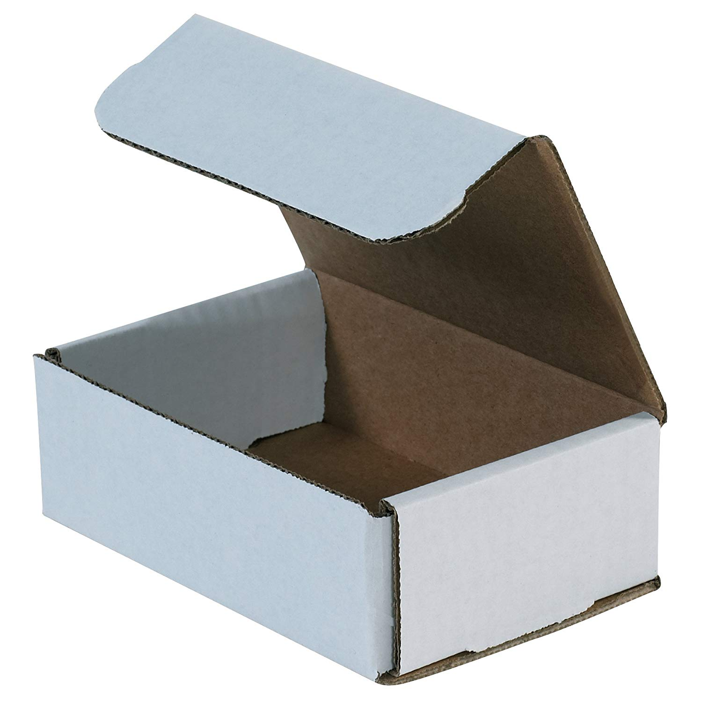
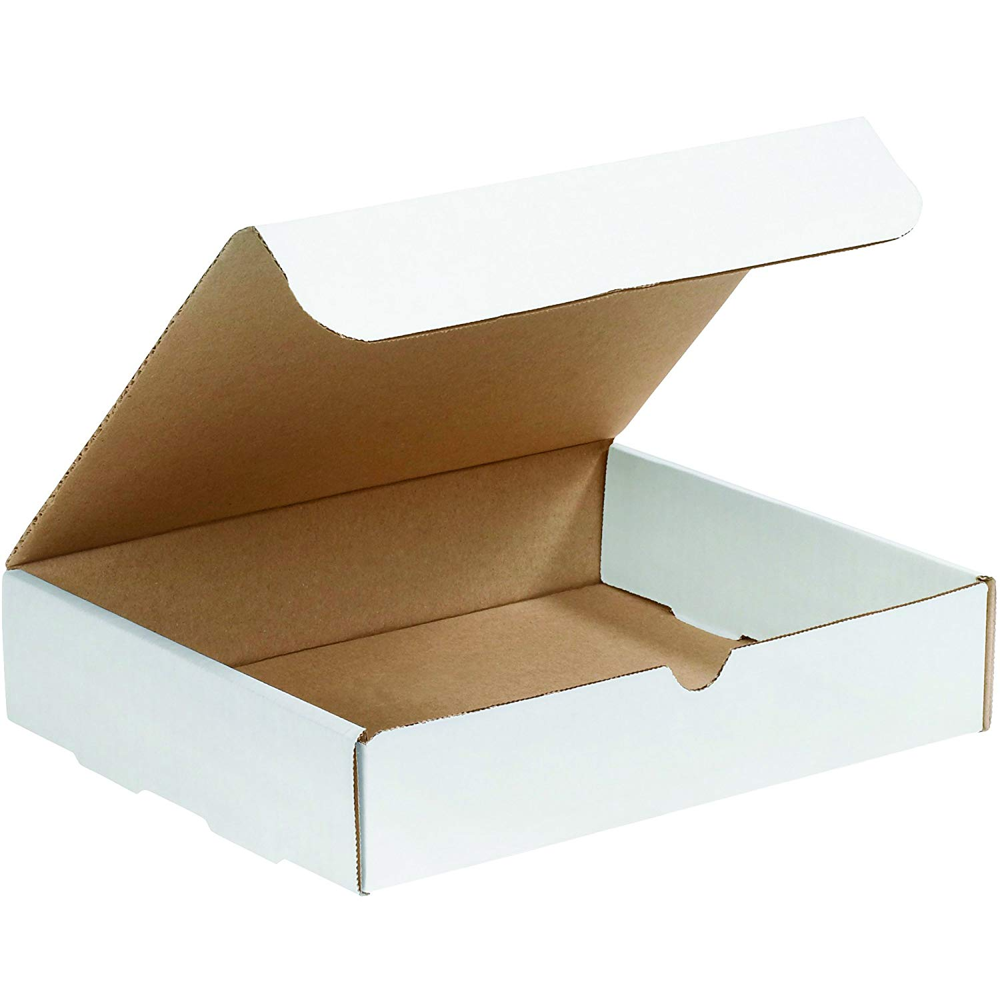
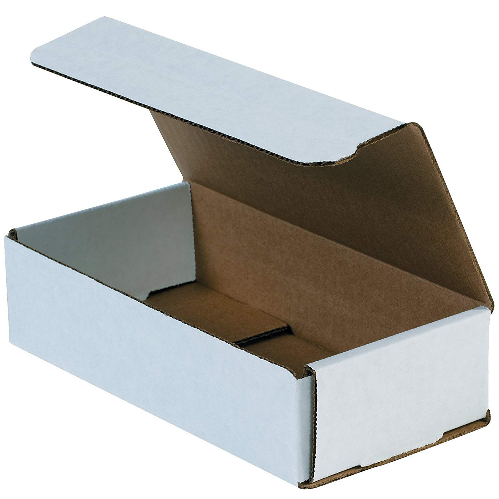

# HCP Type B
Packaging Type B denotes prefabricated cardboard boxes, such as the 6"x4"x2" boxes we have used for many years to ship stickers.

Because even the smallest boxes contain hundreds of stickers, they are mostly used for shipping stickers to hackathons or large clubs with high sticker utilization.

Type B packages may also contain other non-sticker supplies for club leaders, event organizers, or Mail Team Nodemasters.

## Type B1
Type B1 is the 6"x4"x2" folded cardboard box. It is primarily used to ship stickers (up to 300 stickers at a time, usually as full shrink-wrapped bundles).

[Acceptable Amazon Choice](https://www.amazon.com/Aviditi-M642-Corrugated-Mailer-Length/dp/B005ENLYEY/)

## Type B2
Type B2 is the 12"x9"x2" folded cardboard box. It is used to ship moderate quantities of materials, such as printed A4 sheets, 9x12 envelopes, or large volumes of stickers.

[Acceptable Amazon Choice](https://www.amazon.com/BOX-USA-BM1292-White-Pack/dp/B01D9SZVKS/)

## Type B3
Type B3 is the 9"x4"x3" folded cardboard box. It is used primarily to ship large volumes of stickers to large events or clubs. This is the smallest box able to fit all HC stickers currently in print.

[Acceptable Amazon Choice](https://www.amazon.com/Aviditi-M943-Corrugated-Mailer-Length/dp/B000ZJOP7K/)

## Type B4
Type B4 is the 12"x12"x6" folded cardboard box. It is used primarily to ship bulk volumes of stickers to Nodemasters.

[Acceptable Amazon Choice](https://www.amazon.com/gp/product/B01D9T3ZRS)