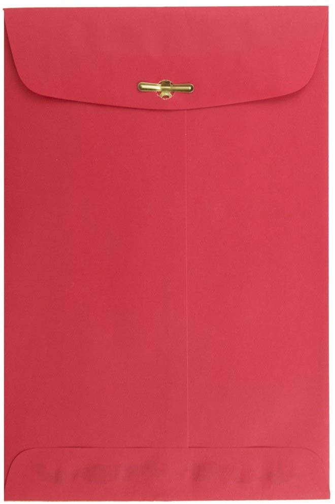
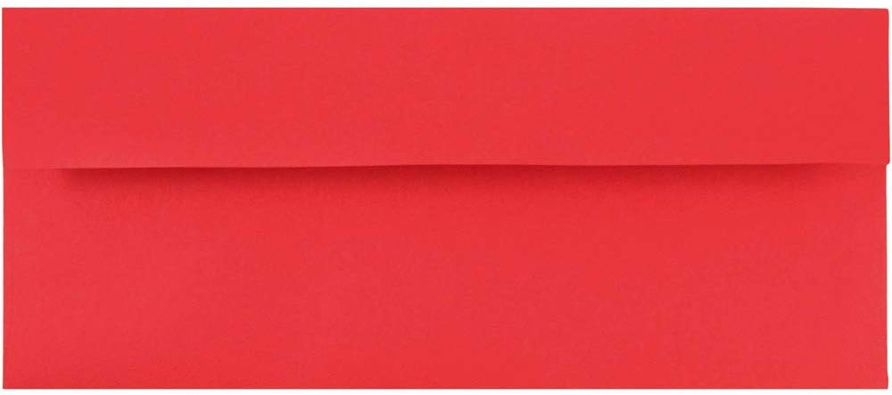
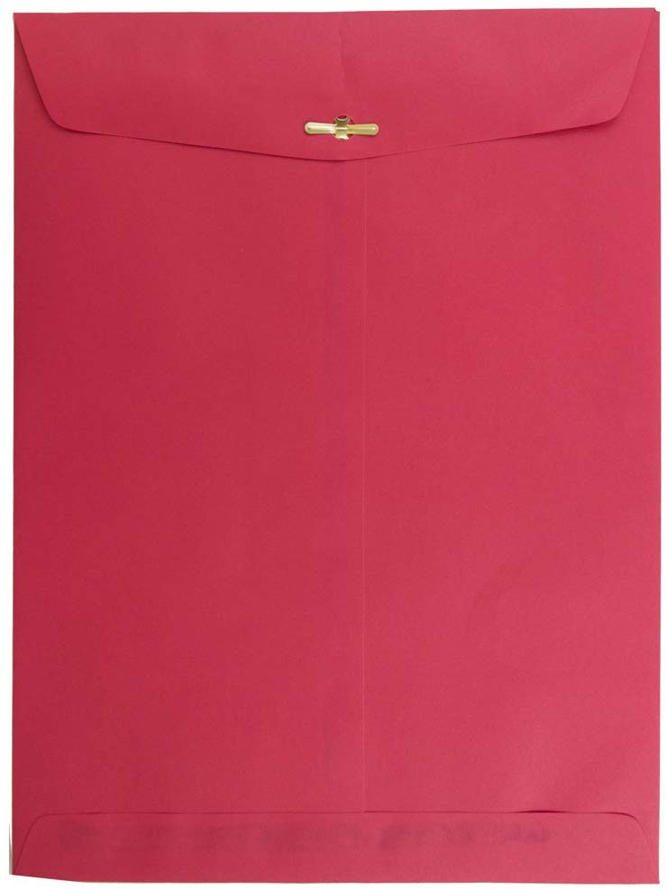
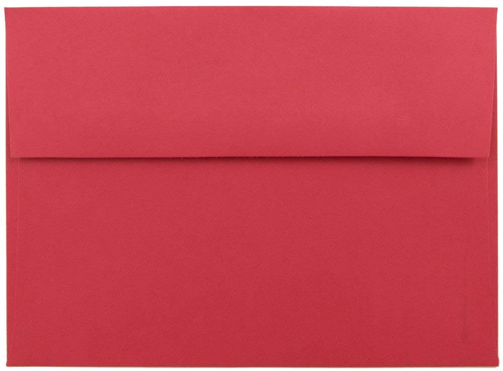

# HCP Type C
Packaging Type C denotes prefabricated envelopes, such as 6"x9" clasp-sealed ("Manila") envelopes or standard 4.125"x9.5" (#10) envelopes.

These are used to mail flat payloads in circumstances where using Type A packaging is not viable. For example, Type A packaging would require too much time when mailing large numbers of low-value payloads.

Because they are less sturdy than Type A envelopes, **care must be taken to prevent stickers from bunching up** at the bottom of Type C packaging.

## Type C1
Type C1 is the 6"x9" clasp-sealed envelope, sometimes called a Manila envelope.

[Acceptable Amazon Choice](https://www.amazon.com/JAM-Paper-Brite-Christmas-Envelopes/dp/B003PJXVWC/ref=sr_1_8?keywords=6x9+red+envelopes&qid=1577389905&sr=8-8)

## Type C2
Type C2 is the ubiquitous 4.125"x9.5" glue-sealed envelope, also known as the #10 Envelope. Type C2 is used for mailing small bundles of folded A4 paper (potentially with small quantities of stickers).

[Acceptable Amazon Choice](https://www.amazon.com/JAM-Business-Colored-Recycled-Envelopes/dp/B00P6R0WMS/ref=sr_1_13?keywords=%2310%2Bred%2Benvelopes&qid=1577392317&sr=8-13&th=1)

## Type C3
Type C3 is the 9"x12" clasp-sealed envelope, sometimes called a Manila envelope. Type C3 is used for mailing stacks of A4 paper that are best delivered un-folded.

[Acceptable Amazon Choice](https://www.amazon.com/JAM-Colored-Recycled-Envelopes-Closure/dp/B003PJVZ8O/ref=sr_1_4?keywords=red+manila+envelope&qid=1577390577&sr=8-4)

## Type C4
Type C4 is the 5.25"x7.25" glue-sealed envelope, also known as the A7. Type C4 is used for mailing small quantities of stickers.

[Acceptable Amazon Choice](https://www.amazon.com/JAM-PAPER-Colored-Invitation-Envelopes/dp/B00OV8JKTY/ref=sr_1_10?keywords=a7+envelope+red&qid=1577390953&sr=8-10)